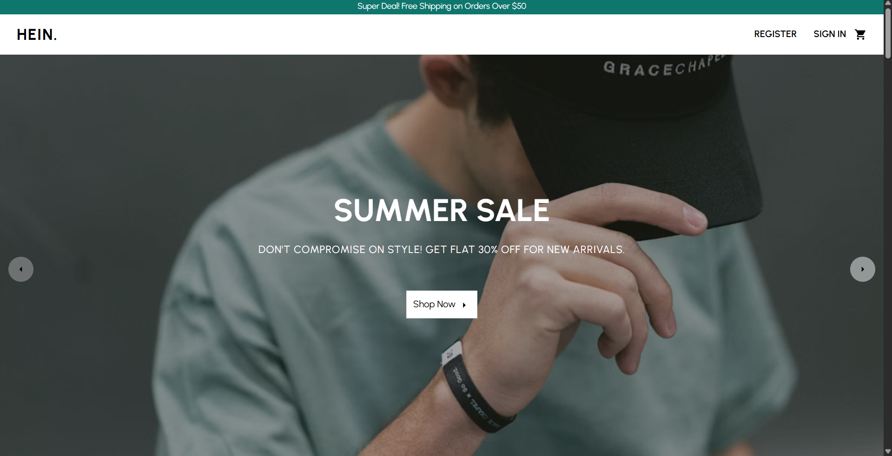
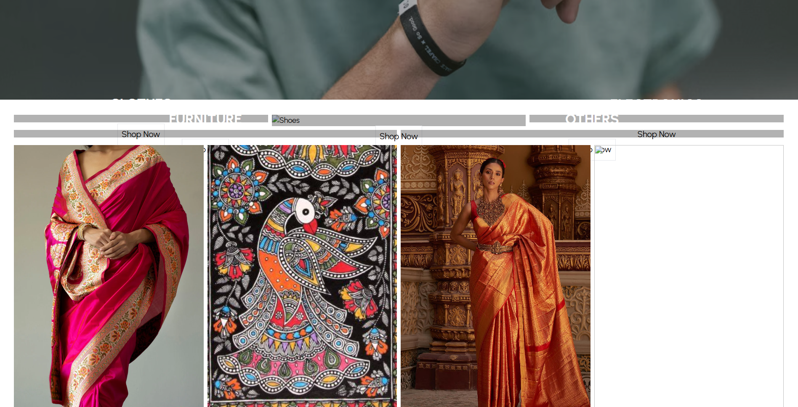
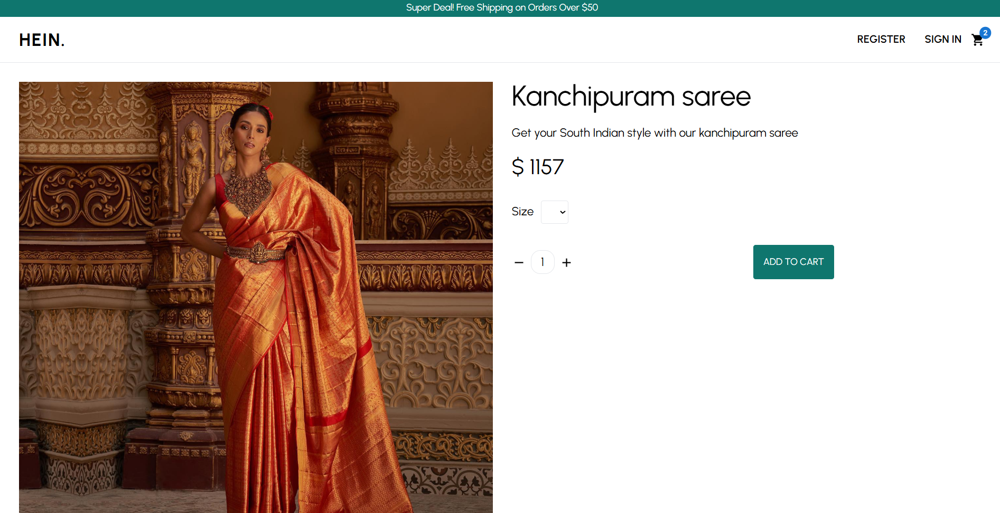
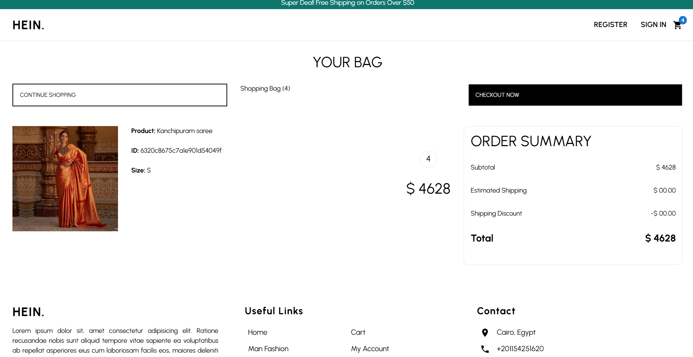
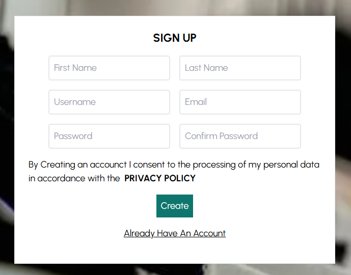

# 🛒 ShopitUp – MERN E-commerce Web Application

> "Build it with purpose. Shop it with ease."

**ShopitUp** is a full-featured e-commerce web application built using the **MERN stack** (MongoDB, Express.js, React, Node.js). It offers a seamless online shopping experience with product filtering, secure authentication, cart management, and order processing, integrated with Stripe for payments.

---

## 📸 Screenshots

### 🏠 Home Page  

### 🛍️ Product Categories  

### 🧾 Single Product View  

### 🛒 Shopping Cart  

### 🔐 Signup  

---

## 🛠️ Tech Stack

### Frontend:
- ⚛️ React with Vite
- 🌬 TailwindCSS for styling
- 🔄 Redux Toolkit for state management
- 🧾 Axios for API calls

### Backend:
- 🌐 Node.js + Express.js
- 🗃 MongoDB + Mongoose
- 🔐 JWT for Auth
- 💳 Stripe for payment integration

---

## ✅ Features

- User Signup/Login with JWT Authentication
- Product Listing with Filters & Categories
- Add to Cart & Order Summary
- Secure Checkout with Stripe Payments
- View Orders History
- Fully Responsive Design
- Modular and Scalable Codebase

---

### 🔧 Prerequisites

- Node.js (v16+)
- MongoDB installed and running

---

## 🙋‍♂️ Created By

Made with ❤️ by [Sushil Gupta](https://github.com/SGgithub001)  
🎓 Student @ Manav Rachna International Institute of Research and Studies  

